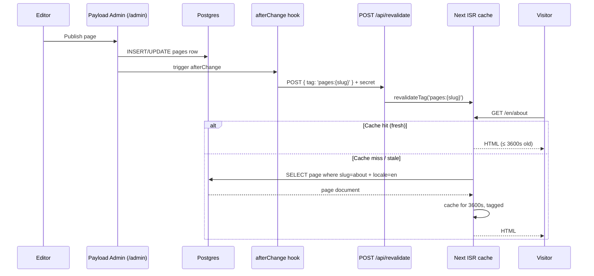

# KingdomCars — Architecture

Single-deployment Next.js 16 + Payload 3 application serving three locales
(`pl` / `en` / `ru`) from one Postgres database, fronted by Caddy with
automatic HTTPS.

For decisions on _why_ rather than _what_, see [`adr/`](adr/).

---

## High-level

```mermaid
flowchart LR
  Browser["Browser / Mobile"] -->|443 TLS| Caddy
  Caddy -->|reverse-proxy 3000| App["Next.js + Payload<br/>(monolith)"]
  App -->|@payloadcms/db-postgres| PG[(Postgres 16)]
  App -->|payload-media volume| MediaFS[("/app/payload-media")]
  App -->|Bot API HTTPS| TG[Telegram bot]
  App -.optional.-> Sentry[(Sentry)]
  App -.optional.-> Umami[(Umami / Plausible)]

  Admin["Editor / Admin"] -->|/admin| Caddy
  CronHost["Host cron"] -->|scripts/backup-db.sh| PG
```

Three runtime services live in `docker-compose.yml`:

- **app** — single Node 22 container running Next.js standalone + Payload admin together.
- **postgres** — Postgres 16 with one volume (`postgres-data`).
- **caddy** — TLS termination + Let's Encrypt; serves all traffic.

There is no separate API server. Payload's admin and the public frontend are
the same Next.js process; the admin route group (`src/app/(payload)/`)
mounts on `/admin`, the public group (`src/app/(frontend)/`) on `/`.

---

## Source-tree layers

```
src/
├── app/             # routing & layouts only — no business logic
│   ├── (frontend)/  # public routes, all under [locale]/
│   ├── (payload)/   # auto-generated admin, do not edit
│   └── api/         # locale-less endpoints: /health, /revalidate, /contact
├── components/
│   ├── ui/          # shadcn-derived presentational primitives
│   ├── animations/  # FadeIn, SlideIn, Stagger… (Framer Motion wrappers)
│   ├── blocks/      # one .tsx per Payload block schema
│   ├── layout/      # Header, Footer, Container, NavLink, MobileMenu
│   └── features/    # ContactForm, LanguageSwitcher, ThemeToggle
├── lib/             # pure functions / I/O helpers
│   ├── env.ts       # Zod-validated env (server + client schemas)
│   ├── payload.ts   # cached `getPayload()` singleton
│   ├── get-page.ts  # ISR-cached page fetcher (tags: pages, pages:{locale}, pages:{slug})
│   ├── rate-limit.ts  # Upstash Redis or in-memory LRU fallback
│   ├── telegram.ts    # HTML-escaped bot message sender (5s AbortController)
│   ├── seo.ts         # JSON-LD builders
│   ├── page-metadata.ts  # hreflang + OG + Twitter from Payload SEO group
│   └── logger.ts      # pino wrapper, JSON in prod, pretty in dev
├── payload/
│   ├── payload.config.ts
│   ├── collections/   # Users, Pages, Media, FormSubmissions, Redirects
│   ├── globals/       # Header, Footer, SiteSettings
│   ├── blocks/        # 13 block schemas
│   ├── fields/        # reusable: link, seo
│   ├── access/        # anyone, isAdmin, publishedOnly
│   └── hooks/         # check-mfa, hash-ip, revalidate-page
├── i18n/
│   ├── routing.ts     # next-intl: pathnames per locale
│   ├── request.ts     # message-loader binding
│   └── messages/      # pl.json / en.json / ru.json
└── types/             # domain types (PageDoc, blocks, globals)
```

**Hard rule:** files stay ≤ 100 lines (§4.1). When a file grows, decompose.
The single-responsibility rule (§4.2) means a component that fetches and
renders and formats is three files.

---

## Data flow: content from CMS to page



Three cache tags per page:

- `pages` — global flush (any page changed)
- `pages:{locale}` — locale-wide flush (translation bulk update)
- `pages:{slug}` — single-page flush (the common path)

The webhook secret is `REVALIDATE_SECRET` from env. The hook lives in
`src/payload/hooks/revalidate-page.ts`.

---

## Build-time DB dependency

Per §17, public pages are statically generated:
`generateStaticParams + ISR (revalidate: 3600)`. This means `next build`
**connects to Postgres** during the "Collecting page data" phase to enumerate
slugs and fetch their bodies.

That's why `docker-compose.yml` starts Postgres before `docker compose build app`,
and the Dockerfile builder stage runs with `build.network: host` — so it can
reach `localhost:5432` where compose just stood up the DB.

Implications:

- Cleaning rooms: a Docker build cannot create a fresh stack from zero
  without first seeding the DB schema (see `scripts/seed.ts`).
- CI: the `e2e` job in `ci.yml` spins up a sidecar `postgres:16-alpine`
  service, seeds it, and runs against it.
- Dev: `npm run dev` connects to whatever `DATABASE_URL` env says — usually
  a local Postgres or compose-`postgres` exposed on `5432`.

---

## Auth & sessions

Two distinct auth realms:

1. **Admin** (Payload's built-in JWT). Issued at `/admin/login`, stored as
   `httpOnly` cookie. Brute-force protected by `lib/rate-limit.ts`
   (`checkLoginRateLimit`). 2FA gate via `check-mfa.ts` hook —
   verifies a TOTP code stored as a base32 secret on the user row.

2. **Public** — there is no public user account. Contact submissions and
   cookie-consent are the only state stored per-visitor; both via cookies.

No session refresh, no rotating tokens. Admin sessions expire per Payload's
default; CSRF is handled by Server Actions automatically.

---

## i18n: two layers

| Layer                                             | Source of truth                 | When to use              |
| ------------------------------------------------- | ------------------------------- | ------------------------ |
| **Content** (pages, blocks, nav labels)           | Payload `localization` config   | Anything an editor types |
| **UI strings** (button labels, validation errors) | `i18n/messages/{pl,en,ru}.json` | Anything shipped as code |

URL slugs are localised too (see `i18n/routing.ts`):
`/uslugi` (pl) ↔ `/services` (en) ↔ `/uslugi` (ru). Default locale `pl` has no
prefix; `/en/...` and `/ru/...` for the other two. `hreflang` alternates emit
on every page via `buildPageMetadata`.

---

## Forms: Server Action path

The contact form (`src/components/features/ContactForm.tsx`) uses
react-hook-form + Zod, then submits via a Server Action
(`src/actions/submit-contact.ts`). The flow:

1. Client-side Zod validation (defence in depth).
2. Server-side Zod re-validation.
3. Honeypot check — silently return `ok: true` if filled.
4. Rate-limit by IP (3 req / 10 min default).
5. Persist to Payload `form-submissions` collection; the `hash-ip.ts`
   `beforeChange` hook replaces raw IP with SHA-256 before write.
6. Send to Telegram (HTML-escaped, 5s timeout). If TG fails, user still sees
   success — submission is in DB, error logged to Sentry.

A no-JS fallback exists at `/api/contact` (POST formData → same action). The
form has a hidden `register('locale')` input so locale survives the trip.

---

## Where to look first

- "Why does the admin redirect on 2FA setup?" → `src/payload/hooks/check-mfa.ts`
- "Why is `/about` cached for an hour?" → `src/lib/get-page.ts` + spec §17
- "How are env vars validated?" → `src/lib/env.ts`
- "How does Caddy know my domain?" → `docker/caddy/Caddyfile` + `.env`
- "How is the DB backed up?" → `scripts/backup-db.sh` + `Makefile :backup`
- "What does CI run?" → `.github/workflows/ci.yml`
